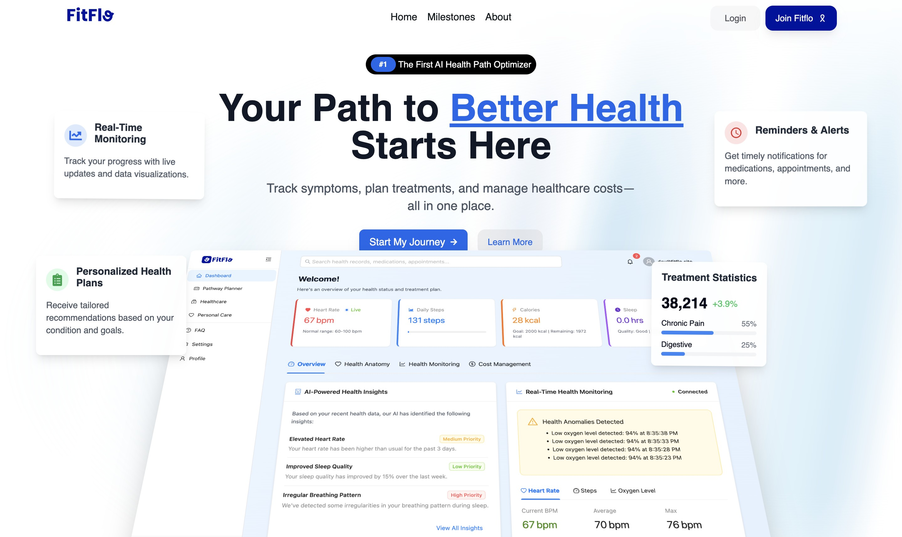
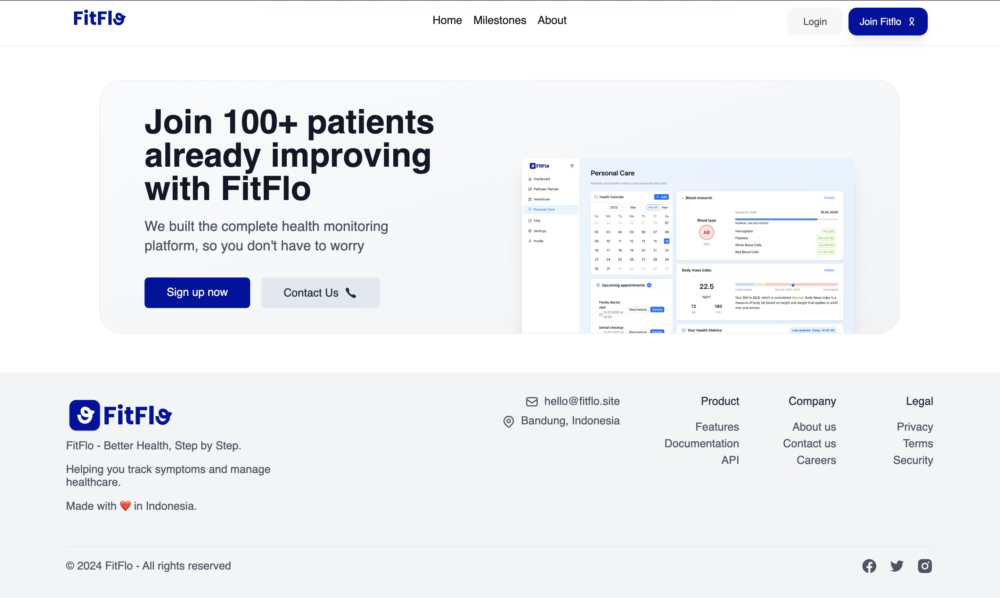
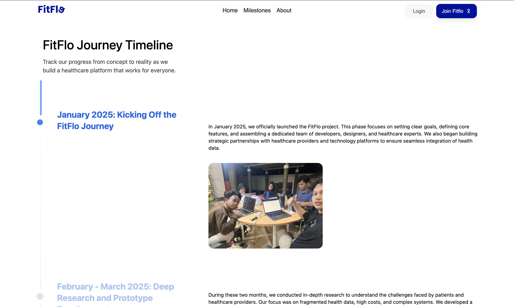
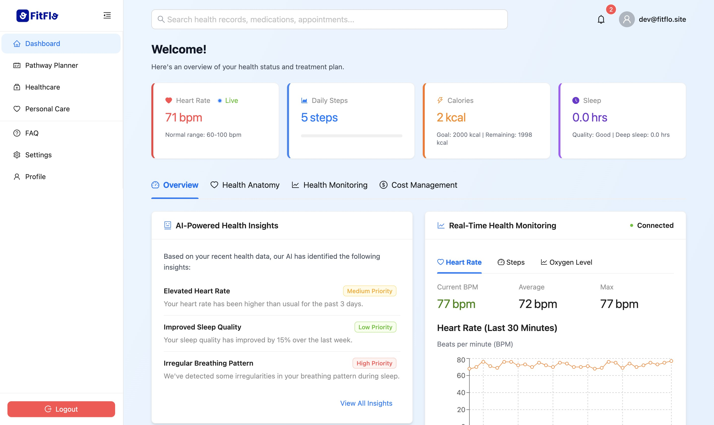
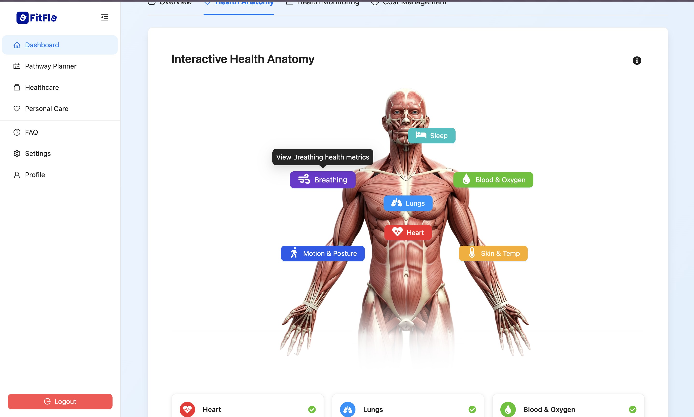
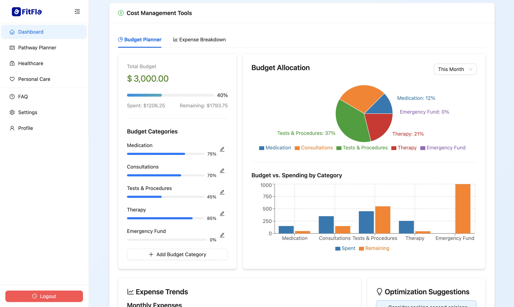
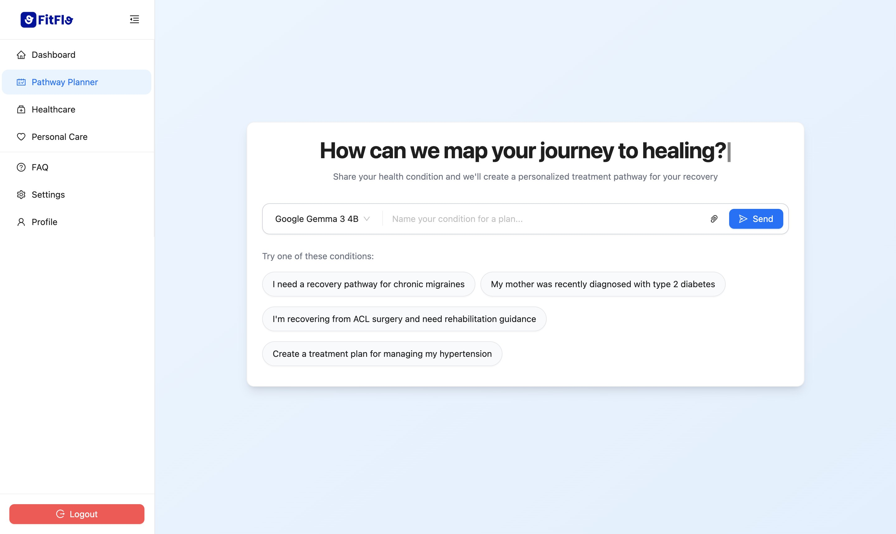
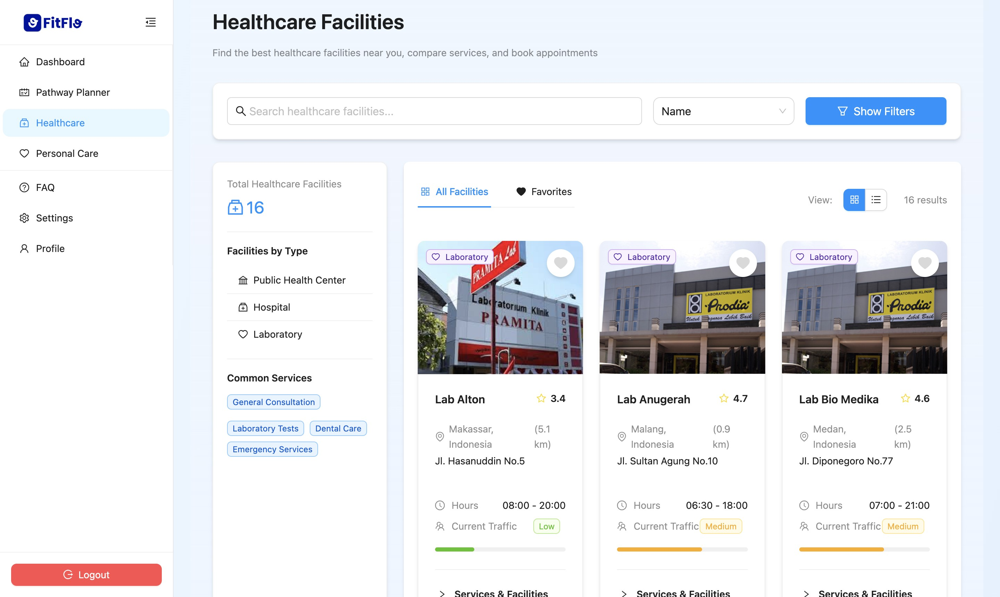
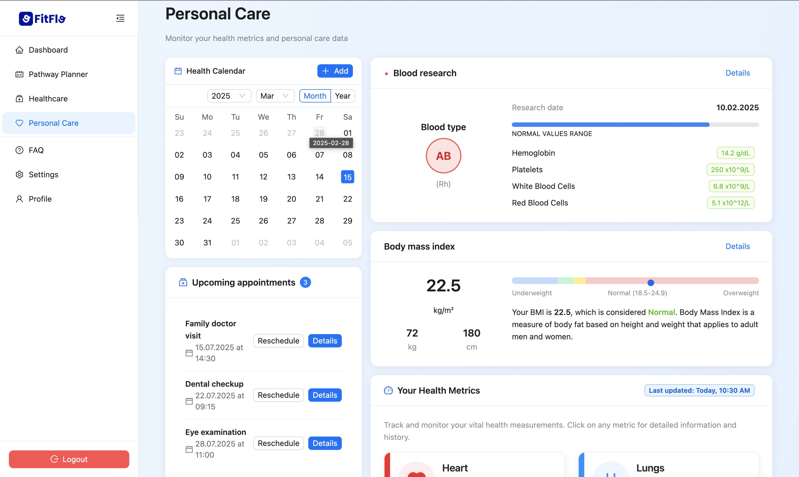

<!-- INTRO -->
<br />
<div align="center">
  <h1 align="center">Fitflo Frontend</h1>

  <p align="center">
    <h3> Welcome to the **FitFlo Frontend** repository! This Frontend provides an intuitive interface for users to manage their health journeys, view personalized AI-driven recommendations, and navigate healthcare options with ease.</h3>
  </p>

  [![MIT License][license-shield]][license-url]

</div>

<!-- CONTRIBUTOR -->
<div align="center" id="contributor">
  <strong>
    <h3>Created by ITB Team:</h3>
    <table align="center">
      <tr>
        <td>Name</td>
      </tr>
      <tr>
        <td>Andhita Naura H.</td>
     </tr>
     <tr>
        <td>Aththriq Lisan Q. D. S.</td>
    </tr>
     <tr>
        <td>Eleanor Cordelia</td>
    </tr>
     <tr>
        <td>Marzuli Suhada M</td>
    </tr>
     <tr>
        <td>Muhammad Faiz A</td>
    </tr>
    </table>
  </strong>
</div>

## Table of Contents
- [Project Overview](#project-overview)
- [Tech Stack](#tech-stack)
- [Installation](#installation)
- [License](#license)
   
## Project Overview
FitFlo is an AI-powered healthcare pathway planner designed to deliver a seamless and interactive user experience. This front-end, built with React and Vite, provides an intuitive interface for users to manage their health journeys, view personalized AI-driven recommendations, and navigate healthcare options with ease. It integrates visually rich components, smooth animations, and responsive design to enhance usability and engagement.

FitFlo is deployed on [fitflo.site](https://fitflo.site) and it's API (Back End) deployed on [api.fitflo.site](https://api.fitflo.site)

FitFlo Front-End Repository: [https://github.com/FitFlo-App/FitFlo-FE](https://github.com/FitFlo-App/FitFlo-FE)<br>
FitFlo Back-End Repository: [https://github.com/FitFlo-App/FitFlo-BE](https://github.com/FitFlo-App/FitFlo-BE)

<p align="center">
  <!-- https://raw.githubusercontent.com/FitFlo-App/FitFlo-FE/main/ -->
  
  
  
  
  
  
  
  
  
</p>

## Tech Stack
- **Framework & Build Tool**  
  - React.js for front-end development  
  - Vite for fast development and optimized builds  

- **UI Components & Styling**  
  - **Ant Design** and **Hero UI** for pre-built components  
  - **Radix UI** for accessible and customizable UI elements  
  - **Tailwind CSS** for utility-first styling  
  - **ShadCN UI** for additional UI utilities  
  - **Lucide React** and **Tabler Icons** for iconography  

- **State Management & Routing**  
  - React Router for client-side navigation  

- **Animations & Interactivity**  
  - Framer Motion and Motion for smooth animations  
  - React Flow and XYFlow for interactive visualizations  

- **Data Handling & API Calls**  
  - Axios for making HTTP requests  
  - Recharts for data visualization  

- **Development & Tooling**  
  - TypeScript for type safety  
  - ESLint and Prettier for code quality and formatting  
  - Vite TSConfig Paths for module resolution  
  - PostCSS and Autoprefixer for CSS processing

## Installation
To set up the Frontend locally:

1. Clone the repository:
   ```sh
   git clone https://github.com/FitFlo-App/FitFlo-FE.git
   cd FitFlo-FE
   ```

2. Run development server
   ```sh
   npm run dev
   ```

## License
This project is licensed under the MIT License.

---
### 🌟 We appreciate your contributions to FitFlo! 
If you have any questions, feel free to open an issue or contact us.

<br>
<h3 align="center"> Thank You! </h3>

<!-- MARKDOWN LINKS & IMAGES -->
<!-- https://www.markdownguide.org/basic-syntax/#reference-style-links -->
[license-shield]: https://img.shields.io/github/license/FitFlo-App/FitFlo-FE.svg?style=for-the-badge
[license-url]: https://github.com/FitFlo-App/FitFlo-FE.git/blob/main/LICENSE
