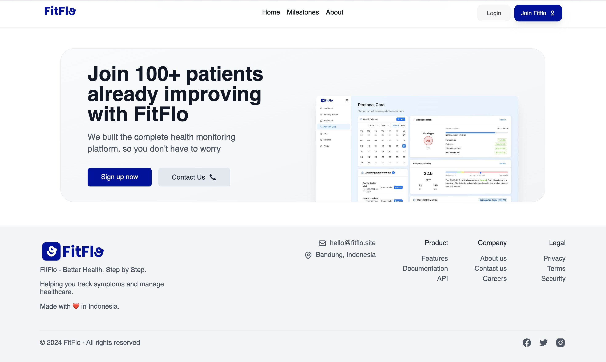
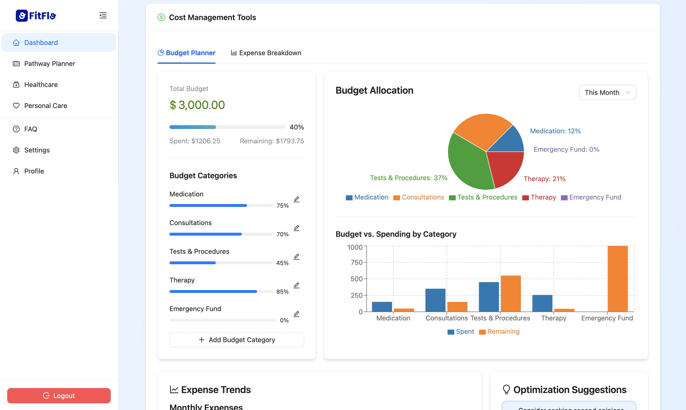
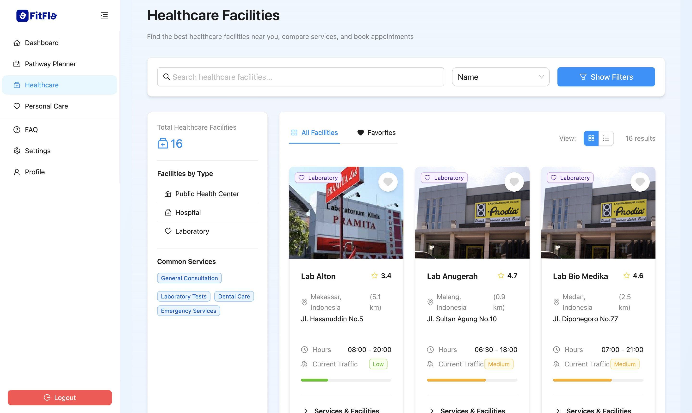
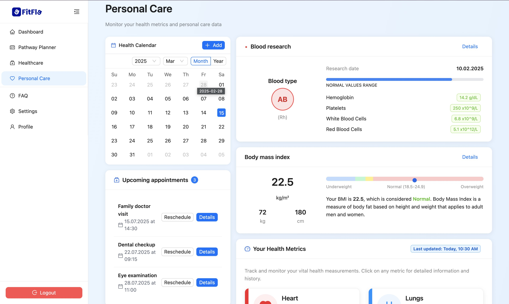

<div align="center">
  <table border="1">
    <tr>
      <td align="center" style="padding: 20px;">
        <h3>📢 Domain & Email Migration Notice</h3>
        <p>Since <b>13 March 2026</b>, FitFlo has transitioned to new domains as <code>fitflo.site</code> was not renewed:</p>
        <p>🌐 <b>Website:</b> <a href="https://fitflo.faizath.com">fitflo.faizath.com</a> (formerly <i>fitflo.site</i>)<br>
        ⚙️ <b>API:</b> <a href="https://fitflo-api.faizath.com">fitflo-api.faizath.com</a> (formerly <i>api.fitflo.site</i>)<br>
        📧 <b>Email:</b> <code>contact@fitflo.faizath.com</code> (formerly <i>contact@fitflo.site</i>)</p>
      </td>
    </tr>
  </table>
</div>

<!-- PROJECT LOGO -->
<br />
<div align="center">
  <a href="https://fitflo.faizath.com/">
    
  </a>

  <h1 align="center">FitFlo</h1>

  <p align="center">
    <strong>AI-Powered Healthcare Pathway Planner for Value-Based Care</strong>
    <br />
    Submitted for <strong>HealthHack 2025</strong> by National University of Singapore
    <br />
    <br />
    <a href="https://fitflo.faizath.com/">View Demo</a>
    ·
    <a href="https://github.com/FitFlo-App/FitFlo-FE/issues">Report Bug</a>
    ·
    <a href="https://github.com/FitFlo-App/FitFlo-FE/issues">Request Feature</a>
  </p>

  [![MIT License][license-shield]][license-url]
  [![React][react-shield]][react-url]
  [![Vite][vite-shield]][vite-url]
  [![Tailwind][tailwind-shield]][tailwind-url]

</div>

---

## 🌟 About FitFlo

**FitFlo** is an AI-driven healthcare pathway planner designed to revolutionize the patient journey by aligning with the principles of **Value-Based Healthcare**. Developed for **HealthHack 2025** (Theme 1), FitFlo shifts the focus from the volume of services to the *value* of care delivered, empowering patients with personalized, data-driven health insights.

### 🎯 The Challenge: Value-Based Healthcare
Value-based healthcare emphasizes improving patient outcomes while reducing costs. Modern healthcare faces challenges in tracking outcomes across different care settings and maintaining quality while managing expenses.

### 💡 Our Solution
FitFlo leverages AI and real-time data analytics to:
1.  **Track & Improve Outcomes:** Interactive treatment pathways and real-time monitoring ensure patients stay on the optimal path to recovery.
2.  **Reduce Costs:** By providing AI-driven recommendations and efficient pathway planning, we minimize unnecessary procedures and administrative overhead.

---

## 🚀 Live Links & Repositories

| Component | Repository | Deployment |
| :--- | :--- | :--- |
| **Frontend** | [GitHub Repo](https://github.com/FitFlo-App/FitFlo-FE) | [fitflo.faizath.com](https://fitflo.faizath.com/) |
| **Backend** | [GitHub Repo](https://github.com/FitFlo-App/FitFlo-BE) | [fitflo-api.faizath.com](https://fitflo-api.faizath.com/) |

---

## 🛠 Tech Stack

### Frontend
- **Core:** [React 18](https://reactjs.org/), [TypeScript](https://www.typescriptlang.org/), [Vite](https://vitejs.dev/)
- **UI Frameworks:** [Hero UI](https://heroui.com/), [Ant Design](https://ant.design/), [Shadcn UI](https://ui.shadcn.com/)
- **Styling:** [Tailwind CSS](https://tailwindcss.com/), [Framer Motion](https://www.framer.com/motion/)
- **Visualizations:** [React Flow / XYFlow](https://reactflow.dev/) (Interactive Pathways), [Recharts](https://recharts.org/) (Health Analytics)
- **Icons:** [Lucide React](https://lucide.dev/), [Tabler Icons](https://tabler-icons.io/)

### Backend
- **Core:** [Node.js](https://nodejs.org/), [Express](https://expressjs.com/)
- **Database:** **InterSystems IRIS** (High-performance health data), [MongoDB](https://www.mongodb.com/) (Mongoose), [Redis](https://redis.io/)
- **AI/ML:** [@xenova/transformers](https://huggingface.co/docs/transformers.js/), [Natural](https://github.com/NaturalNode/natural)
- **Auth:** [Passport.js](https://www.passportjs.org/) (Google OAuth), [JWT](https://jwt.io/)

---

## 📸 Screenshots

<p align="center">
  
  
  
  <br />
  
  
  
  <br />
  
  
  
</p>

---

## 👥 Meet the Team

**Created by ITB Team:**

- **Andhita Naura H.**
- **Aththriq Lisan Q. D. S.**
- **Eleanor Cordelia**
- **Marzuli Suhada M**
- **Muhammad Faiz A**

---

## ⚙️ Getting Started

### Prerequisites
- Node.js (v18+)
- npm or yarn

### Installation
1.  **Clone the repository:**
    ```bash
    git clone https://github.com/FitFlo-App/FitFlo-FE.git
    cd FitFlo-FE
    ```
2.  **Install dependencies:**
    ```bash
    npm install
    ```
3.  **Run development server:**
    ```bash
    npm run dev
    ```

---

## 📜 License
Distributed under the MIT License. See `LICENSE` for more information.

---
<p align="center">Built with ❤️ for HealthHack 2025</p>

<!-- MARKDOWN LINKS & IMAGES -->
[license-shield]: https://img.shields.io/github/license/FitFlo-App/FitFlo-FE.svg?style=for-the-badge
[license-url]: https://github.com/FitFlo-App/FitFlo-FE/blob/main/LICENSE
[react-shield]: https://img.shields.io/badge/React-20232A?style=for-the-badge&logo=react&logoColor=61DAFB
[react-url]: https://reactjs.org/
[vite-shield]: https://img.shields.io/badge/Vite-646CFF?style=for-the-badge&logo=vite&logoColor=white
[vite-url]: https://vitejs.dev/
[tailwind-shield]: https://img.shields.io/badge/Tailwind_CSS-38B2AC?style=for-the-badge&logo=tailwind-css&logoColor=white
[tailwind-url]: https://tailwindcss.com/
